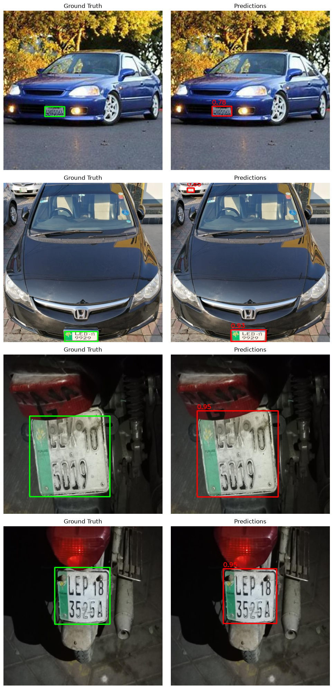

# Pakistani ANPR — YOLO26 Plate & Vehicle Detection + Tracking

YOLO26-based Automatic Number Plate Recognition (ANPR) pipeline for Pakistani vehicles. Detects and tracks license plates and vehicles (cars, motorcycles, buses, trucks) in video using Ultralytics YOLO26 + BoT-SORT, fine-tuned on a custom Roboflow dataset. Includes training, evaluation, and Colab-to-Drive workflow.

## Architecture

```
Frame
  ↓
YOLO26 detector (fine-tuned on a Pakistani number-plate dataset)
  ↓
Tracker (BoT-SORT default / ByteTrack alternative) → persistent track_id
  ↓
Combined with a pretrained YOLO26 vehicle detector (car / motorcycle / bus / truck / bicycle)
  ↓
Annotated output video with tracked plates + tracked vehicles
```

## Dataset

- **Source:** Roboflow — `burhan-khan/pk-number-plates` (version 3)
- **Format:** Ultralytics YOLO (`yolo26`)
- **Split:** 1234 train images / 350 validation images
- **Classes:** 1 (`Number-Plate`)

## Training

- **Model:** YOLO26n (nano)
- **Epochs:** 80 · **Image size:** 640 · **Optimizer:** auto (AdamW)
- **Hardware:** Colab T4 GPU

## Results

| Metric | Score |
|---|---|
| Precision | 0.909 |
| Recall | 0.890 |
| mAP50 | 0.950 |
| mAP50-95 | 0.740 |



> Note: this matrix was generated at the default confusion-matrix confidence threshold (0.25). Re-run validation at `conf=0.5` for a matrix consistent with the precision/recall above.

## Pipeline Features

- Fine-tunes YOLO26n on a custom Roboflow plate dataset
- Auto-repairs and visualizes the dataset before training
- Resumable training (picks up from `last.pt` if a Colab session drops)
- Full evaluation report: precision, recall, mAP50, mAP50-95, confusion matrix, PR curves
- Google Drive backup of weights and evaluation results
- Combined **plate + multi-class vehicle** detection and tracking on video (car, motorcycle, bus, truck, bicycle) using Ultralytics' built-in tracker
- Annotated output video saved locally and to Drive

## Usage

1. Open the notebook in Google Colab (GPU runtime).
2. Add your `ROBOFLOW_API_KEY` as a Colab secret.
3. Run through **Sections 1–13** to install, mount Drive, download the dataset, train, and evaluate.
4. Upload a test video, set `SOURCE_VIDEO` in the Configuration section, and run **Section 14** for combined plate + vehicle detection and tracking.

## References

- [YOLO26](https://docs.ultralytics.com/models/yolo26)
- [YOLO26 training](https://docs.ultralytics.com/modes/train)
- [Ultralytics tracking](https://docs.ultralytics.com/modes/track)

## License

Add your license here.
